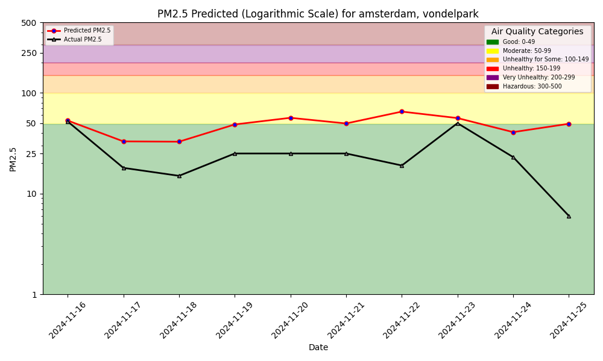

# Air Quality System Dashboard

The air-quality prediction ML System consists of:

| Dynamic Data  | Prediction Problem | User Interface  |  Monitoring |
| ------------- |:-------------:| ------------:| ------------:|
| Air Quality Sensor Data: [aqicn.org](aqicn.org) &   Weather Forecasts: [open-meteo.com](open-meteo.com) | Air Quality Forecasting of the level of PM2.5| Github Pages | Hindcasts |

# The Dashboard



There is also a Python program to interact with the air quality ML system using language (text, voice),
powered by a [function-calling LLM](https://www.hopsworks.ai/dictionary/function-calling-with-llms).

# Model Performance Monitoring

1-Day Hindcast: Predictions vs Outcomes

